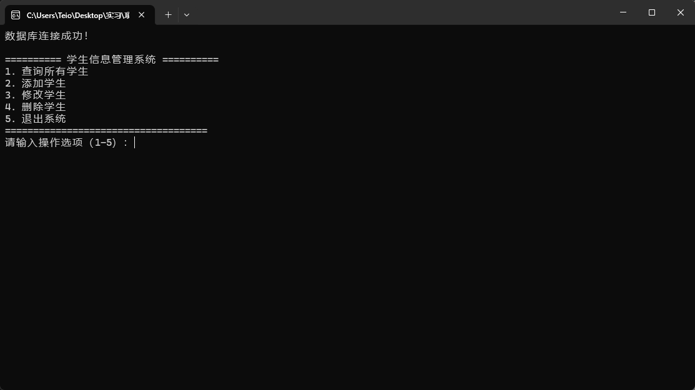
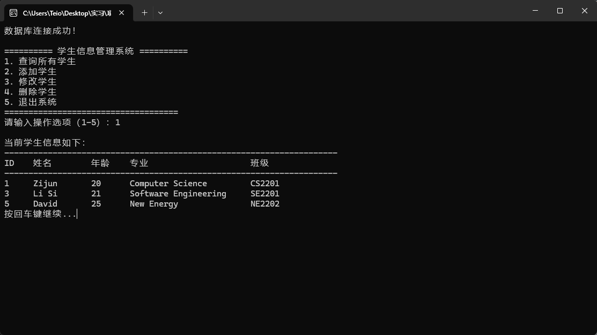

# 学生信息管理系统（C++ + MySQL）

一个基于 C++ 与 MySQL 的命令行学生管理系统，实现了完整的增删改查功能，并具备输入校验、异常处理和良好的用户交互体验。

## 项目简介

本项目是一个控制台（CLI）学生管理系统，使用 C++ 结合 MySQL 数据库开发，实现对学生信息的管理，包括：

- 查询学生信息
- 添加学生
- 修改学生
- 删除学生

项目重点在于：
- 数据库操作（MySQL Connector/C++）
- 控制台交互设计
- 输入校验与异常处理
- 代码结构优化与可维护性


##  功能列表

### 查询功能
- 查询所有学生信息（表格对齐显示）
- 支持无数据提示

### 添加学生
- 输入姓名、年龄、专业、班级
- 所有输入均进行合法性校验

### 修改学生
- 根据 ID 修改学生信息
- 修改前自动检查学生是否存在
- 支持逐字段更新

### 删除学生
- 根据 ID 删除学生
- 删除前二次确认（防止误操作）

---

## 核心优化点（重点亮点）

### 输入校验系统（函数化封装）
- 防止空输入
- 限制输入类型（数字 / 字母 / 字母+数字）
- 提高代码复用性

### 控制台交互优化
- 统一输入方式（解决 `cin` / `getline` 冲突）
- 修复“需要按两次回车”的问题
- 增加“按回车继续”功能

### 表格输出对齐
- 使用 `iomanip` 实现列对齐
- 所有字段（ID / 姓名 / 年龄 / 专业 / 班级）统一格式输出

### 安全性增强
- 删除操作增加确认步骤（Y/N）
- 修改操作检查数据是否存在

### 异常处理机制
- 捕获 MySQL 异常（`sql::SQLException`）
- 捕获标准异常（`std::exception`）
- 防止程序崩溃

### 中文支持
- 控制台 UTF-8 编码支持
- 中文输入输出正常显示

---

## 🛠 技术栈

- **语言**：C++
- **数据库**：MySQL 8
- **数据库接口**：MySQL Connector/C++
- **开发环境**：Visual Studio 2022
- **编码方式**：UTF-8

---

## 📷 运行截图

#### 主菜单


#### 查询结果


---

## ✨ 功能

- 添加学生信息
- 查询学生信息
- 修改学生信息
- 删除学生信息（带确认）
- 输入合法性校验
- 控制台表格对齐输出
- 异常处理防崩溃

---

## 项目结构

```text
StudentManagementSystem/
├── main.cpp
├── sql/
│   └── init.sql
├── screenshots/
│   ├── menu.png
│   └── query.png
├── README.md
└── StudentManagementSystem.sln

